# Relatório – Tecnologias Hacker  

## Pergunta 1  
**Pesquise e registre aqui dois exemplos de IDS.**

- **IDS Baseado em Anomalias (Anomaly-Based IDS)**:
O IDS baseado em anomalias foca em identificar desvios do comportamento normal dentro de uma rede ou sistema. Ele funciona estabelecendo uma linha de base para a atividade normal, por meio da análise estatística do tráfego de rede ou da atividade do sistema ao longo do tempo. Essa linha de base torna-se uma referência para identificar anomalias. O IDS então monitora continuamente o tráfego da rede ou a atividade do sistema e compara os dados em tempo real com as linhas de base estabelecidas. Desvios significativos dessas linhas de base são sinalizados como potenciais intrusões.

- **IDS Baseado em Assinaturas (Signature-Based IDS)**:
O IDS baseado em assinaturas depende de um banco de dados pré-definido de assinaturas de ataques para identificar atividades maliciosas. Essas assinaturas representam padrões conhecidos ou “impressões digitais” de ataques de rede ou comportamentos suspeitos do sistema. O IDS monitora continuamente o tráfego de rede ou a atividade do sistema e compara esses dados com o banco de assinaturas de ataques. Qualquer correspondência gera um alerta, indicando uma possível tentativa de intrusão.

---

## Pergunta 2  
**Quais as diferenças entre IDS e IPS?**

- **IDS (Intrusion Detection System)**  
  - Função: detectar atividades suspeitas.  
  - Atua de forma **passiva**: apenas gera alertas.  
  - Exemplo: avisa o administrador quando identifica um *scan* de portas.  

- **IPS (Intrusion Prevention System)**  
  - Função: prevenir ataques em tempo real.  
  - Atua de forma **ativa**: pode bloquear pacotes ou endereços automaticamente.  
  - Exemplo: descarta tráfego malicioso ao ser detectado.  

---

## Estatísticas e análise de dados

- Testando os filtros e ferramentas de estatísticas do WireShark, foi possível obter os seguintes gráficos:

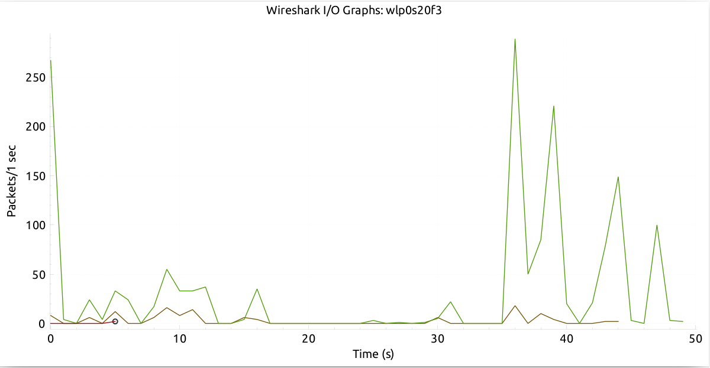
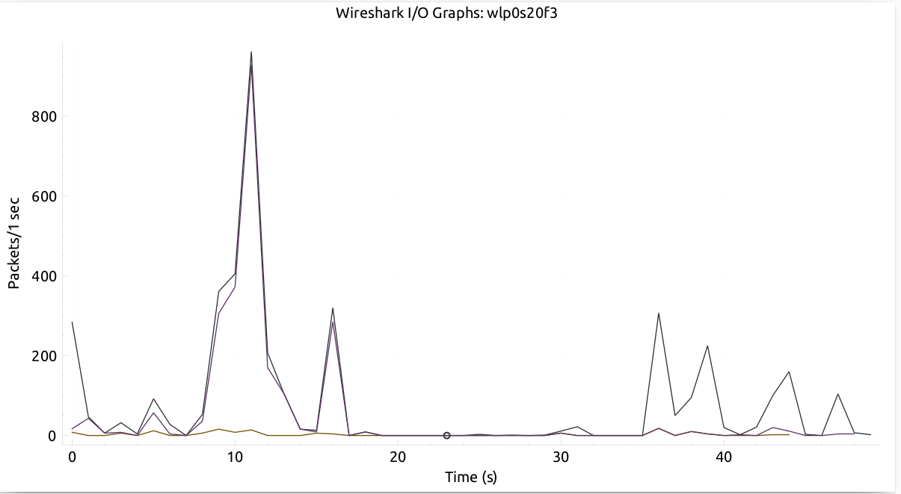
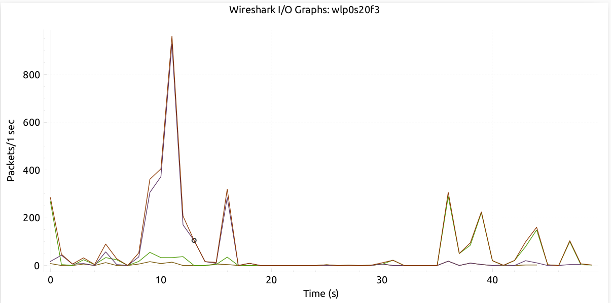

## Desafio 1

- **Pergunta 1:** 
Qual o IP do controlador de domínio desta rede?

    O IP do controlador de domínio é 10.0.19.9, pois este é o servidor que responde às consultas LDAP (porta 389), que é o protocolo utilizado para comunicação com Active Directory em ambientes Windows.
    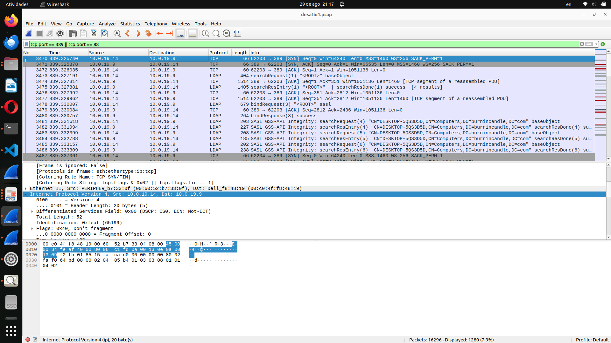

**Pergunta 2:** Liste as conexões que você julga suspeitas.

* Autenticação LDAP com SASL GSS-API de 10.0.19.14 para 10.0.19.9 (pacotes 3478, 3480, 3481 etc.): Isso indica que o malware pode ter comprometido credenciais válidas para acessar o controlador de domínio, o que é típico em ataques de movimentação lateral ou coleta de informações.

* Tentativa de conexão TCP na porta 62204 para a porta 389 em 10.0.19.9 (pacote 3488): Portas não padrão como 62204 são frequentemente usadas por malwares para evitar detecção e estabelecer canais de comunicação secundários. Esta conexão ocorre após a autenticação LDAP bem-sucedida, suggesting uma possível tentativa de exfiltração de dados ou download de código malicioso.

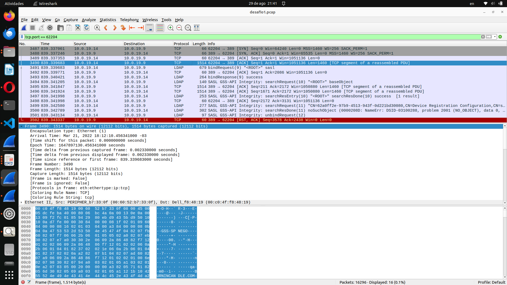

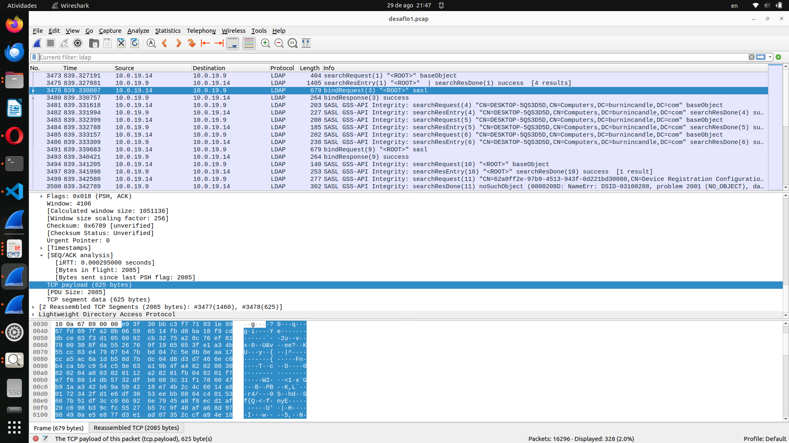

**Pergunta 3:** Qual conexão baixou o código malicioso?
* A conexão que provavelmente baixou o código malicioso é a conexão TCP na porta 62204 (pacote 3488). Embora esta conexão esteja direcionada ao controlador de domínio (10.0.19.9), o uso de uma porta alta e não padrão é consistente com o comportamento do malware IceID, que often usa canais secundários para downloads de payloads. Alternativamente, é possível que o código tenha sido embutido nas respostas LDAP (como nos pacotes 3475 ou 3485), mas isso é menos comum e a conexão na porta 62204 é a mais suspeita para download.

## Desafio 2

**Pergunta 3:** Qual é o endereço MAC do cliente Windows em 192.168.2.147?
* O endereço MAC do cliente Windows em 192.168.2.147 é bc:5f:f4:d1:29

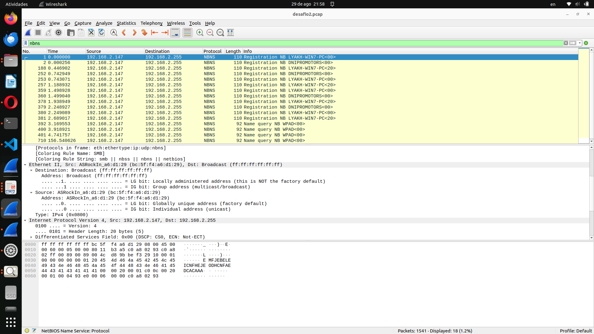

**Pergunta 4:** Qual é o nome do host para o cliente Windows em 192.168.2.147?
* O nome de host é LYAKH-WIN7-PC.
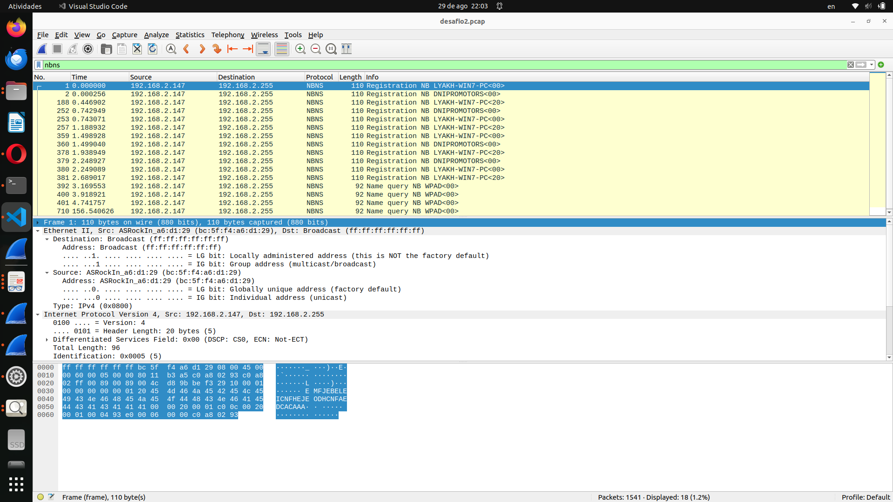

**Pergunta 5:** : Com base no tráfego do protocolo Kerberos, qual é o nome da conta de usuário
do Windows usado em 192.168.2.147?
* O nome da conta de usuário do Windows usado em 192.168.2.147 é ASRockIn$
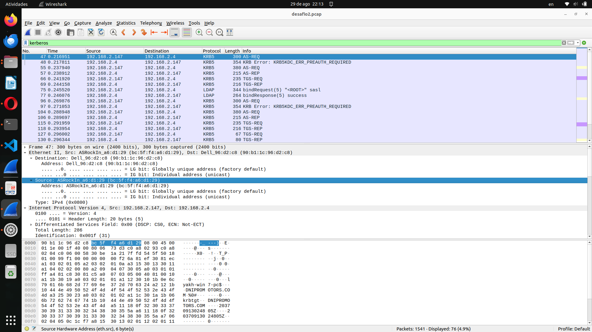

**Pergunta 6:** Qual a função do protocolo Kerberos?
* O protocolo Kerberos é utilizado para autenticação em redes de computadores. Ele permite que usuários e serviços se autentiquem de forma segura, utilizando tickets para evitar a transmissão de senhas pela rede. Isso ajuda a proteger contra ataques de interceptação e replay.

**Pergunta 7:** Qual é a URL que retornou um arquivo executável do Windows?
* A URL que retornou um arquivo executável do Windows é hxxp://micropcsystem.com/hojuks/vez.exe
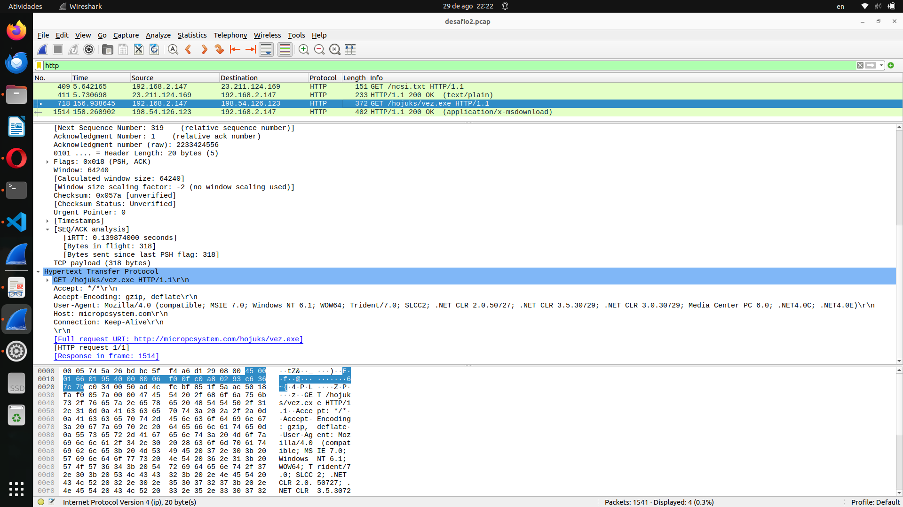

**Pergunta 8:** Qual data e hora que a URL foi acessada?
* Arrival Time: Nov 13, 2018 00:02:13.680850000 -02

**Pergunta 9:** Depois de receber o arquivo executável, com qual endereço IP o host
infectado do Windows tentou estabelecer uma conexão TCP?
* O host infectado do Windows em 192.168.2.147 tentou estabelecer uma conexão TCP.

## Desafio 3

**Pergunta 10:** Qual é o endereço MAC do cliente Windows em 172.17.1.129?

* O endereço MAC do cliente Windows em 172.17.1.129 é 00:1e:67:4a:d7:5c

**Pergunta 11:** Qual é o nome do host para o cliente Windows em 172.17.1.129?
* O nome do host é NALYVAIKO-PC

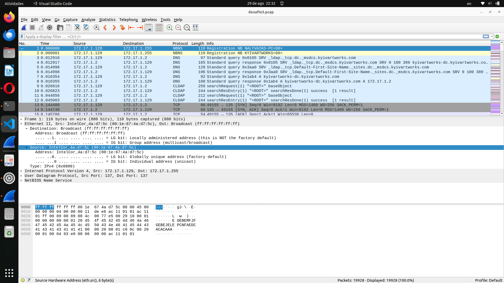

**Pergunta 12:** Com base no tráfego Kerberos, qual é o nome da conta de usuário do
Windows usado em 172.17.1.129?
* O nome da conta de usuário do Windows usado em 172.17.1.129 é nalyvaiko-pc$.
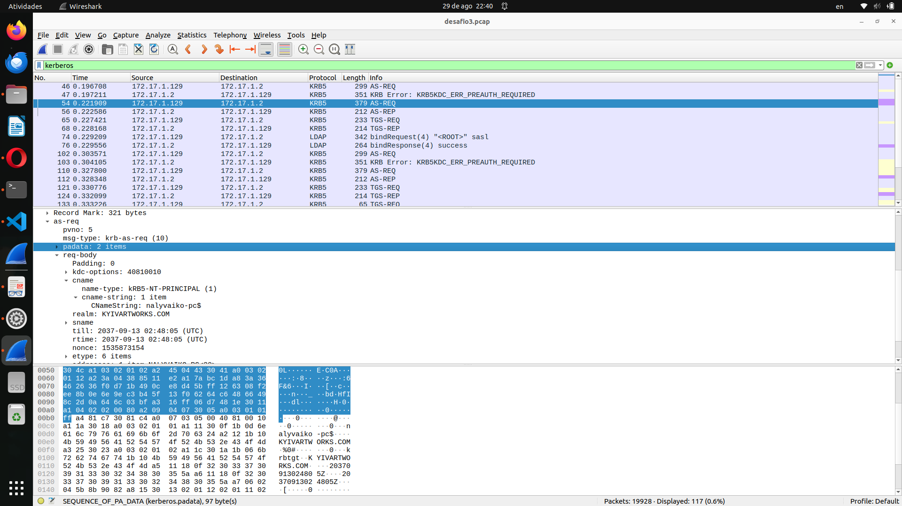

**Pergunta 13:** Qual URL no pcap retornou um documento do Microsoft Word?

* http://ifcingenieria.cl/QpX8It/BIZ/Firmenkunden/

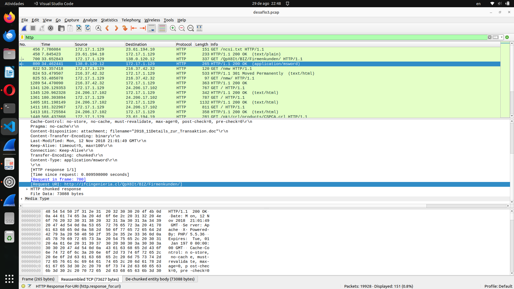

**Pergunta 14:** Qual data e hora que a URL foi criada?
* Mon, 12 Nov 2018 21:01:49 GMT

**Pergunta 15:** Qual URL no pcap retornou um arquivo executável do Windows?
* A URL que retornou um arquivo executável do Windows é http://ifcingenieria.cl/QpX8It/BIZ/Firmenkunden/